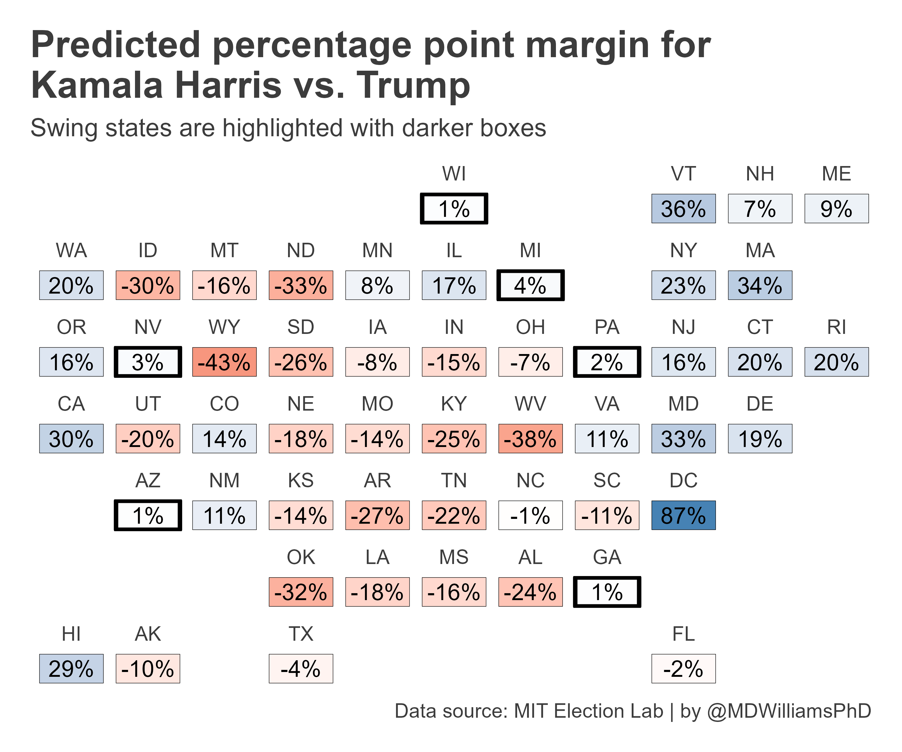
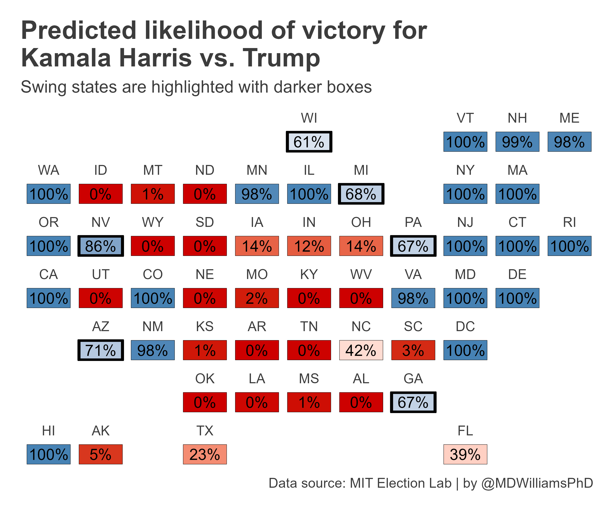
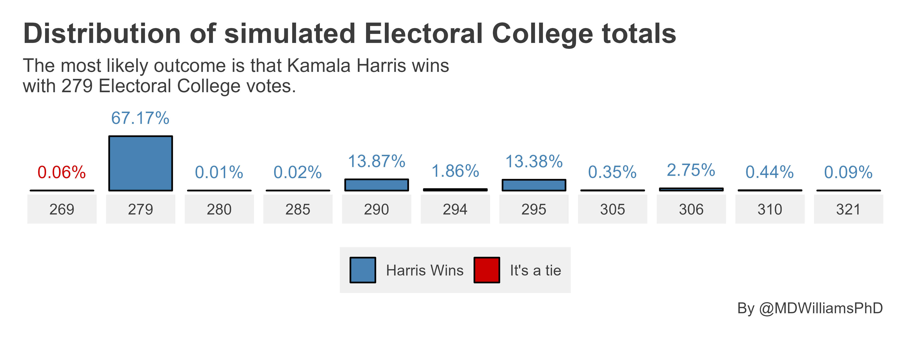

# 2024 Presidential Election Forecast

For fun, I wanted to try my hand at a 2024 US Presidential election forecast. Here's the current predictions as of 9-28-2024.

First up are state-level predictions for Harris' popular vote margin relative to Trump's. These predictions are based on a hierarchical linear model fit using previous election state-level margins for the Democratic Party with random intercepts and slopes by state. The results show that Harris is predicted to win nearly all the swing states, but by very small margins.

Second up are state-level likelihoods that Harris will win the popular vote instead of Trump. These likelihoods are based on bootstrapped predictions from the previous model. The results show, again, that Harris is likely to win 4 out of 7 swing states. While the model seems certain that she'll win Wisconsin, Michigan, Pennsylvania, and Nevada, the model indicates she'll more than likely loose Arizona, Georgia, and North Carolina.

Finally, the below figure simulates (based on the previously shown likelihoods) the range of possible electoral college outcomes possible. The distribution is produced via 10,000 simulations of state-level wins and losses based on predicted probabilities of victory, with Harris' electoral college total based on the sum of electoral college votes she'd get if she won the relevant set of states. Harris is predicted to win the 2024 election with a very narrow margin of victory with 279 Electoral College votes—just 9 more than the 270 she needs to secure the presidency. There is a lot of uncertainty about this result; however, the range of empirically supported alternatives skews toward a Harris win with only a fraction of a percentage of scenarios where Trump wins by a narrow margin of 1 Electoral College vote.

## Replication Materials

The code to replicate these results is in the Quarto file `_analysis.qmd`.
