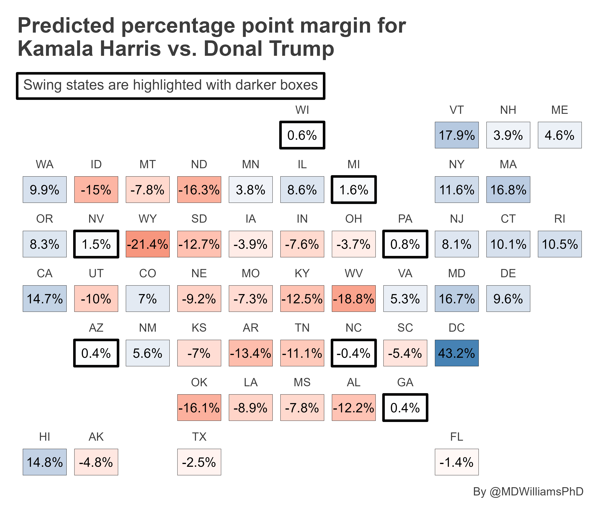
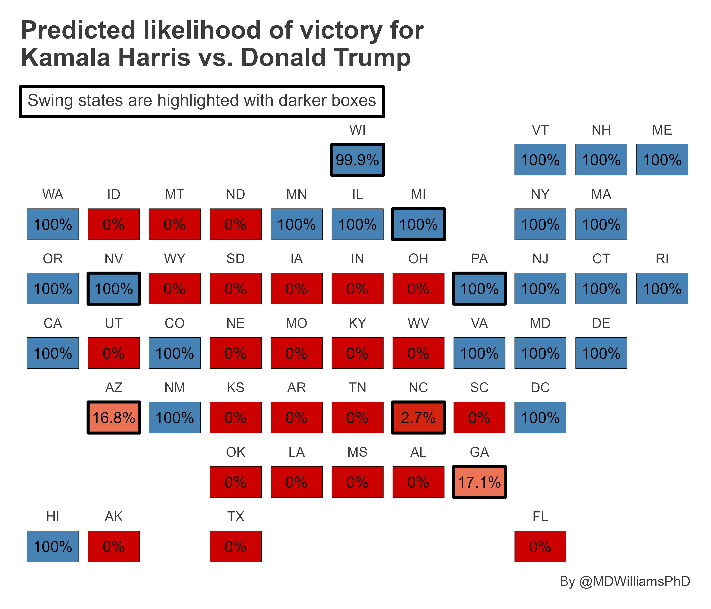

# 2024 Presidential Election Forecast

For fun, I wanted to try my hand at a 2024 US Presidential election forecast. Here's the current predictions as of 9-23-2024.

First up are state-level predictions for Harris' popular vote margin relative to Trump's. These predictions are based on a hierarchical linear model fit using previous election state-level trends in the Democratic Party's popular vote margin, the natural log of overall in-election turnout, with random intercepts and slopes by state. The results show that Harris is predicted to sweep all the swing states by a modest, yet statistically significant, margin.

Second up are state-level likelihoods that Harris will win the popular vote instead of Trump. These likelihoods are based on a hierarchical logit model fit using previous election state-level trends in the Democratic Party's popular vote margin, the natural log of overall in-election turnout, with random intercepts and slopes by state. The results show, again, that Harris is predicted to sweep all the swing states by a modest, yet statistically significant, margin.

Finally, the below figure simulates (based on the previous logit model's predicted likelihoods) the range of possible electoral college outcomes possible. The distribution is produced via 10,000 simulations state-level wins and losses based on predicted probabilities of victory, with Harris' electoral college total based on the sum of electoral college votes she'd get if she won the relevant set of states. Harris is predicted to win the 2024 election with 312 electoral college votes. There is a lot of uncertainty about this result, however, with Harris losing the election in about 7 out of 100 election scenarios.

